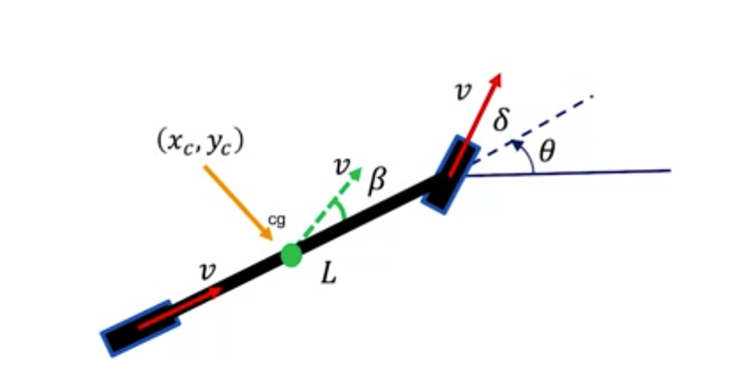

# Controle & Estado atual — Subdivisão de Driverless
## E-Racing Unicamp · Ciclo 2026

> Documentação referente ao período pós-onboarding redigido por novos membros para fins didáticos. Contém vídeo-aulas e conteúdos dinâmicos para aprendizado.

## Sumário

- [1. Primeiros Passos](#1-primeiros-passos)
- [2. Introdução ao Controle](#2-introdução-ao-mapeamento)
- [3. Conceitos Base](#3-conceitos-base)
- [4. Objetivos e Cenário Atual](#4-objetivos-e-cenário-atual)
- [5. Localização e Mapa Global](#5-localização-e-mapa-global)
- [6. Encerramento](#6-encerramento)
- [7. Referências](#7-referências)

## 1. Primeiros Passos

### 1.1 Abertura
Olá! Seja bem vindo a melhor subdivisão de Driverless! O controle!
Primeiramente, parabéns por ter conquistado seu lugar nessa equipe tão linda, e agora já vamos falar do que você precisa saber para trabalhar com a gente!
Antes de começarmos com matérias de fato(física, dinâmica veicular e computação), vamos preparar todo seu ambiente(enviroment).

### 1.2 Dependências técnicas
Enquanto membro de Controle, faremos uso de algumas tecnologias típicas e imprescindíveis para o desenvolvimento de nossos projetos. Entre elas, algumas precisam de instalação separada ou cuidados especiais. 

**Tecnologias típicas:** Python/C/C++, ROS2, MATLAB(23b em diante): Simulink, Stateflow e System composer.

Caso já tenha essas dependências instaladas, prossiga para o tópico 2.

### 1.3 Sistema Operacional
Para desenvolver seus projetos dentro desta subdivisão e como um membro de Driverless em geral, por favor, utilize Linux. 

Preferencialmente, caso não o possua em sua máquina, opte pela versão 22.04, que casa perfeitamente com a distribuição de ROS2 utilizada por nós no computador de bordo(linda jetson agx xavier). 

Em último caso, se já tiver uma versão Linux em sua máquina e ela esteja em outra versão, trate este problema com a utilização de contêineres através do Docker, uma plataforma que permite executar aplicações que possuem diferentes pré-requisitos (como versão de sistema operacional ou linguagem de programação) sem conflitos.

Recomendamos que, para manter seu sistema operacional de preferência (como o Windows), realize um dual boot em sua máquina. Abaixo, deixamos tutoriais para a instalação do Linux e a utilização do Docker para rodar o ROS2, que explicaremos neste documento.

**OBS**: No tutorial de Linux, certifique-se de baixar a versão 22.04 ao adentrar no site oficial do Ubuntu. Caso tenha problemas para realizar a partição, recomendamos a ferramenta MiniTool Partition Wizard, que resolve problemas de arquivos invisíveis ao particionar o disco.
> Tutorial Linux: https://www.youtube.com/watch?v=bzDDiH2Apac

> Tutorial Docker para ROS2: https://www.youtube.com/watch?v=oix-Qs75O08

### 1.4 Python/C/C++ ----falta falar de c
Grande notícia! Na distribuição Ubuntu, Python já vem instalado nativamente. Inclusive, no Linux, muitas coisas são extremamente facilitadas quando o assunto é instalação de programas ou dependências. Para verificar a versão instalada, rode no terminal:

    python3 --version

Caso não tenha nenhuma base, aqui vai uma playlist introdutória com base de lógica de programação, orientação a objetos (muito importante para lidar com ROS2) e, no primeiro episódio, verificações iniciais do sistema em Linux.

> Playlist referenciada: https://www.youtube.com/watch?v=dzXGwmjpKPk&list=PLiLrXujC4CW3AFaMJyhbObGGlehxNC6BF&index=17 

Para C++, o assunto muda um pouco. Python é uma linguagem interpretada, o que significa que o código-fonte é transformado em algo executável e lido em tempo real. C++, por outro lado, é linguagem compilada, o que exige primeiramente que o código-fonte seja traduzido para linguagem de máquina para que depois torne-se executável. Para termos esse tradutor em nossa máquina, executemos os comandos a seguir:

    sudo apt update

    sudo apt install g++

O primeiro comando atualiza lista de programas em nossa máquina. O segundo instala de fato o pacote principal do C++, incluindo o compilador. Pronto! Temos o básico para conseguir programar nossos sistemas.

### 1.5 ROS2
Agora, cuidaremos da instalação do ROS2 em nossa máquina Linux na versão 22.04 da distribuição Ubuntu. Além disso, explicamos como funciona o ROS2 no contexto da nossa divisão de Driverless, especialmente em Mapeamento. Para conferir com mais clareza cada etapa, assista ao conteúdo abaixo:

> Parte 01 - Instalação do ROS2: https://drive.google.com/drive/folders/17aS0WbSZafMps24pM8jX_G5lp2kk-O29?hl=pt-br

**OBS**: Recomendamos que o vídeo abaixo seja visto após ler o resto do documento, para ter uma clareza do porque é importante o ROS2 aqui.
> Parte 02 - Funcionamento do ROS2: https://drive.google.com/drive/folders/17aS0WbSZafMps24pM8jX_G5lp2kk-O29?hl=pt-br

## 2. Introdução ao Controle
Agora, já falando da nossa subdivisão de controle de fato. Antes de seguir para nossa fundamentação teórica, vamos entender de forma rápida como funciona a dinâmica de todas as subdivisões e a nossa em driverless.

### 2.1 Visão Geral
Em Controle, recebemos as coordenadas já processadas por mapeamento, e de fato, fazemos o carro se locomover até essas coordenadas. Tecnicamente, ajustamos os motores(de tração e steering) para que o carro consiga percorrer a rota traçada por mapping, e para fazer isso, utilizamos uma série de modelos físicos virtuais que simulam o comportamento real do carro.

### 2.2 Arquitetura Atual
Para a comunicação entre os subsistemas de cada subdivisão a fim de construir o sistema como um todo, precisamos ter uma maneira de se comunicar para enviar: 

1. As coordenadas de Percepção para Mapeamento

2. A trajetória de Mapeamento para Controle

3. Os comandos de esterçamento e torque para o carro

4. As informações do carro para a Telemetria

Diante disso, utilizamos o middleware ROS2, que apesar do nome ser Robot Operating System, é um conjunto de ferramentas e bibliotecas que facilita o desenvolvimento de robôs e veículos autônomos através do protocolo de comunicação que ele possibilita. Nele, temos diferentes nós que publicam informações em tópicos e, a partir disso, realizam seus comandos e podem repassar informações. Agora provavelmente seja o momento ideal de você conferir aquele vídeo sobre ROS2 que passamos acima.

Como exemplo de funcionamento, podemos ter a seguinte estrutura:

    Nós:
    - perception_node
    - mapping_node
    - control_node

    Tópicos:
    - /coordinates
    - /waypoint

    Mensagens:
    - std_msgs/msg/Float32MultiArray

Exemplo:

    /coordinates:
    [x1, y1, x2, y2]

    /waypoint (ponto médio entre cones):
    [x_wp, y_wp]

O porquê deste waypoint ficará mais claro na seção de conceitos base, mas tenha em mente que é extremamente importante para a construção da trajetória. Normalmente, temos o eixo x como o que está na frente do carro e y como a lateral. Também é comum ter z como a distância à frente do veículo e x como a posição no eixo lateral.

Pipeline:

    Percepção -> Mapeamento -> Controle

    Telemetria (em Paralelo)

## 3. Conceitos Base
Agora já inciando a física do controle, devemos apresentar os conceitos e modelos físicos que embasam todo nosso controle dinâmico. Para isso, vamos falar em alguns tópicos de física que retratam matematicamente o comportamento de um veículo.(Para aqueles que ainda não tiveram tanto contato com físca 1 ou não tem uma base sólida em dinâmica, recomenda-se revisar um pouco para melhor entendimento)

### 3.1 Divisão do Controle: Longitudinal e Lateral
Para transformar a arte de dirigir em linhas de código, dividimos o problema em duas frentes que atuam de forma conjunta, mas com funções bem diferentes:

*   **Controle Longitudinal (Aceleração e Frenagem):** É responsável por controlar a velocidade e a posição do carro ao longo da pista. É ele que determina o torque necessário que os motores elétricos devem aplicar nas rodas ou a pressão de frenagem.
*   **Controle Lateral (Direção):** É o responsável por "virar o volante". Seu objetivo é manter o carro exatamente sobre a trajetória (*waypoints*) enviada pelo Mapeamento[cite: 1], atuando no motor de steering para corrigir desvios laterais.

### 3.2 A Diferença entre Modelos e Controladores
Antes de entrarmos nos algoritmos, precisamos separar duas coisas fundamentais na engenharia de controle: **O Modelo** e **O Controlador**.

*   **O Modelo Físico (A Planta):** É a representação matemática de como o carro real se comporta no mundo físico. Ele nos diz "se eu virar a roda $X$ graus nessa velocidade, o carro vai parar na posição $Y$".
*   **O Controlador (O Algoritmo):** É o "cérebro". Ele usa a matemática do modelo físico para decidir "quantos graus eu preciso virar a roda agora para chegar no *waypoint*?".

**Resumo da nossa arquitetura:**
*   **Para Controle Lateral (Steering):** Usamos o *Modelo Bicicleta* (Física) como base para que os controladores *Pure Pursuit* ou *Stanley* (Algoritmos) calculem o ângulo do volante.
*   **Para Controle Longitudinal (Velocidade):** Usamos a *Física Newtoniana 1D* e a aerodinâmica (Modelo) como base para que o controlador *PID* (Algoritmo) calcule o torque de aceleração ou a força de frenagem.

### 3.3 O Modelo Bicicleta (Bicycle Model)
O modelo bicicleta é a base matemática mais famosa e essencial para começarmos a entender a dinâmica veicular lateral. Ele recebe esse nome porque simplifica as quatro rodas do nosso veículo em apenas duas (uma dianteira e uma traseira), posicionadas ao longo do eixo central longitudinal do chassi.

**Por que usamos?**
Calcular a força, o escorregamento e a suspensão em quatro pneus separadamente exige um modelo complexo (*Full Car Model*). Para o controle de trajetória (nosso foco principal ao receber dados do Mapeamento[cite: 1]), assumimos que os ângulos de esterçamento das rodas direita e esquerda são iguais e desconsideramos a rolagem ou "mergulho" do chassi. Isso reduz drasticamente a carga computacional da nossa Jetson e facilita o projeto dos algoritmos.

**Variáveis importantes no Centro de Gravidade (CG):**

*   $L_L$: Distância entre os eixos do carro
*   $\delta$ (delta): Ângulo de esterçamento da roda dianteira (O output direto que enviamos para o nosso motor de steering!).
*   $\theta$ (theta): Ângulo de guinada (*yaw* ou *heading*), indicando para onde o nariz do carro está apontando em relação ao mapa global[cite: 1].
*   $V$: Velocidade vetorial no CG.

Esse modelo cinemático é o coração geométrico que faz os algoritmos de Controle Lateral funcionarem.
Para ter uma noção geral desse modelo, anexamos uma video aula da University of Luebeck do professor Georg Schildbach em que ele desenvolve todas as equações cinemáticas do modelo(funções horárias da velocidade), e há também uma aula gravada por nós, que, sem desenvolver muito as funções, explicita melhor esse modelo.

aula do you tube: https://www.youtube.com/watch?v=HqNdBiej23I
nossa aula: 

### 3.4 Pure Pursuit
O *Pure Pursuit* é um controlador lateral puramente geométrico. Imagine que o nosso carro está "perseguindo" um ponto virtual (*look-ahead point*) que está alguns metros à frente na trajetória[cite: 1]. O algoritmo desenha um arco de circunferência perfeito saindo do eixo traseiro do carro até atingir esse alvo.
*   **Prós:** Muito robusto, simples de implementar em C/C++ ou Python[cite: 1] e fácil de sintonizar.
*   **Contras:** Pode acabar "cortando curvas" se configurarmos o ponto de perseguição longe demais.

*(Sugestão: Adicionar um desenho mostrando o arco do Pure Pursuit ligando o carro a um waypoint no mapa)*

### 3.5 Controlador Stanley
Desenvolvido pela equipe de Stanford (vencedora do DARPA Grand Challenge), o *Stanley* é um controlador lateral que atua de forma diferente. Em vez de olhar para um ponto distante, ele toma como referência o centro do **eixo dianteiro** do nosso modelo bicicleta e busca minimizar dois erros simultaneamente:
1.  **Erro de Trilha (Cross-track error):** A distância perpendicular do eixo dianteiro até a linha ideal da trajetória.
2.  **Erro de Orientação (Heading error):** A diferença angular entre para onde o carro está apontando ($\psi$) e para onde a pista está indo.

O Stanley costuma apresentar uma resposta de direção mais natural e precisa em curvas fechadas e manobras agressivas do que o Pure Pursuit.

### 3.3 PID (Proporcional, Integral, Derivativo)
*(Sugestão: Inserir um GIF de um sistema (como um pêndulo ou mola) oscilando e depois estabilizando com PID)*

O PID não é um modelo físico, mas sim o algoritmo de malha fechada mais clássico e versátil da engenharia de controle. Ele calcula uma força de correção baseada em três pilares do erro (a diferença entre onde estamos e onde queremos estar):
*   **Proporcional (P):** Reage ao erro atual. Se a velocidade está muito abaixo do alvo, ele acelera bastante.
*   **Integral (I):** Acumula os erros do passado. Ajuda a vencer resistências constantes (como uma subida ou atrito) que o fator P não conseguiu zerar.
*   **Derivativo (D):** Prevê o futuro com base na taxa de variação do erro. Funciona como um "amortecedor" para evitar que o carro passe do ponto e comece a oscilar.

No Driverless, usamos PIDs para tarefas de baixo nível, como garantir que o motor de steering gire exatamente os radianos que pedimos, ou no controle longitudinal para manter uma velocidade alvo constante.

