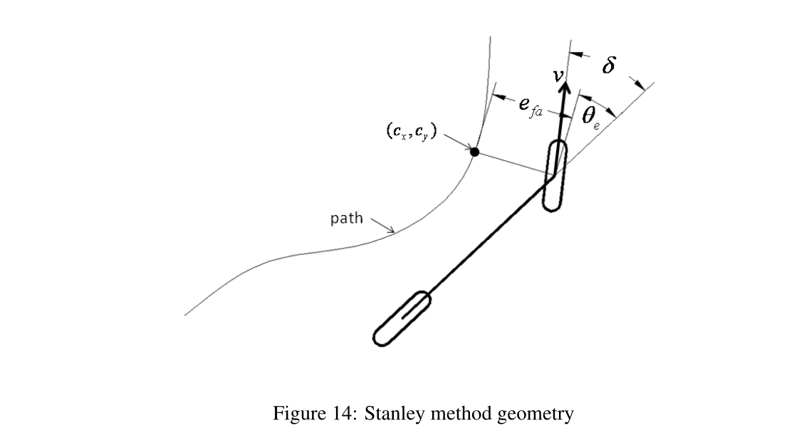

# Controle & Estado Atual — Subdivisão de Driverless
## E-Racing Unicamp · Ciclo 2026

> Documentação referente ao período pós-onboarding, redigida por novos membros para fins didáticos. Contém vídeo-aulas e conteúdos dinâmicos para aprendizado.

## Sumário

- [1. Primeiros Passos](#1-primeiros-passos)
- [2. Introdução ao Controle](#2-introdução-ao-controle)
- [3. Conceitos Base](#3-conceitos-base)
- [4. Ferramentas: MATLAB e Simulink](#4-ferramentas-matlab-e-simulink)
- [5. Cenário Atual e Planos Futuros](#5-cenário-atual-e-planos-futuros)
- [6. Encerramento](#6-encerramento)
- [7. Referências](#7-referências)

## 1. Primeiros Passos

### 1.1 Abertura
Olá! Seja bem-vindo à melhor subdivisão de Driverless: o Controle!

Primeiramente, parabéns por ter conquistado seu lugar nessa equipe tão incrível! Agora vamos falar sobre o que você precisa saber para trabalhar com a gente.

Antes de começarmos com as matérias de fato (física, dinâmica veicular e computação), vamos preparar todo o seu ambiente (environment).

### 1.2 Dependências técnicas
Como membro de Controle, faremos uso de algumas tecnologias típicas e imprescindíveis para o desenvolvimento de nossos projetos. Entre elas, algumas precisam de instalação separada ou de cuidados especiais.

**Tecnologias típicas:** Python, C, C++, ROS2, MATLAB (versão 23b em diante): Simulink, Stateflow e System Composer.

Caso já tenha essas dependências instaladas, prossiga para o tópico 2.

### 1.3 Sistema Operacional
Para desenvolver seus projetos dentro desta subdivisão e, de forma geral, como membro de Driverless, por favor, utilize Linux.

Preferencialmente, caso não o possua em sua máquina, opte pela versão 22.04, que combina perfeitamente com a distribuição de ROS2 utilizada por nós no computador de bordo (a linda Jetson AGX Xavier).

Em último caso, se você já tiver uma versão de Linux em sua máquina e ela estiver em outra versão, resolva esse problema utilizando contêineres através do Docker — uma plataforma que permite executar aplicações com diferentes pré-requisitos (como versão de sistema operacional ou linguagem de programação) sem conflitos.

Recomendamos que, para manter seu sistema operacional de preferência (como o Windows), você realize um dual boot em sua máquina. Abaixo, deixamos tutoriais para a instalação do Linux e para a utilização do Docker com o ROS2, que explicaremos mais adiante neste documento.

**OBS**: No tutorial de Linux, certifique-se de baixar a versão 22.04 ao acessar o site oficial do Ubuntu. Caso tenha problemas para realizar a partição, recomendamos a ferramenta MiniTool Partition Wizard, que resolve problemas de arquivos invisíveis durante o particionamento do disco.

> Tutorial Linux: https://www.youtube.com/watch?v=bzDDiH2Apac

> Tutorial Docker para ROS2: https://www.youtube.com/watch?v=oix-Qs75O08

### 1.4 C / C++ / Python
Boa notícia: na distribuição Ubuntu, o Python já vem instalado nativamente. No Linux, aliás, muitas coisas são bem mais simples quando o assunto é instalação de programas e dependências. Para verificar a versão instalada, rode no terminal:

    python3 --version

Caso não tenha nenhuma base, aqui vai uma playlist introdutória com lógica de programação, orientação a objetos (muito importante para lidar com ROS2) e, no primeiro episódio, verificações iniciais do sistema em Linux.

> Playlist referenciada: https://www.youtube.com/watch?v=dzXGwmjpKPk&list=PLiLrXujC4CW3AFaMJyhbObGGlehxNC6BF&index=17

Para C++, o assunto muda um pouco. Python é uma linguagem interpretada, o que significa que o código-fonte é lido e executado em tempo real. C++, por outro lado, é uma linguagem compilada, o que exige que o código-fonte seja primeiro traduzido para linguagem de máquina para, então, se tornar executável. Para termos esse tradutor em nossa máquina, execute os comandos a seguir:

    sudo apt update

    sudo apt install g++

O primeiro comando atualiza a lista de programas em nossa máquina. O segundo instala de fato o pacote principal do C++, incluindo o compilador. Pronto! Temos o básico para conseguir programar nossos sistemas.

Além disso, precisamos conhecer um pouco da linguagem C para nossos projetos na divisão de Controle. Assim como o C++, o C é uma linguagem compilada e, além disso, já vem instalada em muitas distribuições Linux. Para verificar se o C está instalado, precisamos checar se o compilador *gcc* está presente:

    gcc --version

Caso não esteja instalado, rode:

    sudo apt update
    sudo apt install build-essential

### 1.5 MATLAB & Simulink
Ótimo! Agora vamos aprender um pouco sobre as ferramentas que se conectam ao nosso carro: o MATLAB e o Simulink. \
O MATLAB é uma plataforma de computação numérica e programação. Ele tem sua própria linguagem de programação, também chamada de MATLAB, e conta com um ambiente gráfico de modelagem de sistemas chamado **Simulink**. É no Simulink que grande parte do controle acontece, pois nele criamos nossos modelos e todo o dinamismo dos nossos sistemas. Recomenda-se baixar o MATLAB para Linux. \
Para baixar o MATLAB, você (como aluno da Unicamp) deverá criar uma conta com seu e-mail da DAC (Diretoria Acadêmica), pois assim obterá a licença da plataforma de forma gratuita!

> Link para instalação do MATLAB: https://www.mathworks.com/downloads/ \
> Tutorial MATLAB: https://matlabacademy.mathworks.com/details/matlab-onramp/gettingstarted \
> Tutorial Simulink: https://matlabacademy.mathworks.com/details/simulink-onramp/simulink

**Obs**: caso queira se familiarizar um pouco com a linguagem MATLAB, preparamos um tutorial rápido para você, bixo que ainda não domina MC102 direito. Para acessar, basta abrir o outro arquivo Markdown neste mesmo diretório.

### 1.6 ROS2
Agora, cuidaremos da instalação do ROS2 em nossa máquina Linux, na versão 22.04 da distribuição Ubuntu. Além disso, explicamos como o ROS2 funciona no contexto da nossa divisão de Driverless, especialmente em Mapeamento. Para acompanhar com mais clareza cada etapa, assista ao conteúdo abaixo:

> Parte 01 - Instalação do ROS2: https://drive.google.com/drive/folders/17aS0WbSZafMps24pM8jX_G5lp2kk-O29?hl=pt-br

**OBS**: Recomendamos assistir ao vídeo abaixo somente após ler o restante do documento, para entender com mais clareza por que o ROS2 é importante aqui.

> Parte 02 - Funcionamento do ROS2: https://drive.google.com/drive/folders/17aS0WbSZafMps24pM8jX_G5lp2kk-O29?hl=pt-br

## 2. Introdução ao Controle
Agora, falando de fato sobre a nossa subdivisão de Controle: antes de seguir para a fundamentação teórica, vamos entender rapidamente como funciona a dinâmica entre todas as subdivisões de Driverless e a nossa dentro desse fluxo.

### 2.1 Visão Geral
Em Controle, recebemos as coordenadas já processadas pelo Mapeamento e, de fato, fazemos o carro se locomover até essas coordenadas. Tecnicamente, ajustamos os motores (de tração e de steering) para que o carro consiga percorrer a rota traçada pelo Mapeamento. Para isso, utilizamos uma série de modelos físicos virtuais que simulam o comportamento real do carro.

### 2.2 Arquitetura Atual
Para que os subsistemas de cada subdivisão se comuniquem e construam o sistema como um todo, precisamos de uma forma de enviar:

1. As coordenadas de Percepção para Mapeamento
2. A trajetória de Mapeamento para Controle
3. Os comandos de esterçamento e torque para o carro
4. As informações do carro para a Telemetria

Diante disso, utilizamos o middleware ROS2 que, apesar do nome (Robot Operating System), é na verdade um conjunto de ferramentas e bibliotecas que facilita o desenvolvimento de robôs e veículos autônomos através de um protocolo de comunicação próprio. Nele, temos diferentes nós que publicam informações em tópicos e, a partir disso, executam seus comandos e repassam informações entre si. Este é um bom momento para conferir o vídeo sobre ROS2 indicado acima.

Como exemplo de funcionamento, podemos ter a seguinte estrutura:

    Nós:
    - perception_node
    - mapping_node
    - control_node

    Tópicos:
    - /coordinates
    - /waypoint

    Mensagens:
    - std_msgs/msg/Float32MultiArray

Exemplo:

    /coordinates:
    [x1, y1, x2, y2]

    /waypoint (ponto médio entre cones):
    [x_wp, y_wp]

O porquê deste waypoint ficará mais claro na seção de Conceitos Base, mas tenha em mente que ele é extremamente importante para a construção da trajetória.

> **Nota do revisor:** o texto original descrevia duas convenções de eixos que se contradiziam (x como frente do carro em um trecho, e x como lateral em outro). Vale confirmar e documentar claramente qual convenção cada nó do sistema utiliza — por exemplo, x/y no referencial do veículo (Controle e Mapeamento) versus x/y/z no referencial de um sensor (Percepção) — para evitar erros de integração entre as subdivisões.

Pipeline:

    Percepção -> Mapeamento -> Controle

    Telemetria (em paralelo)

## 3. Conceitos Base
Agora, já iniciando a física do controle, vamos apresentar os conceitos e modelos físicos que embasam todo o nosso controle dinâmico. Para isso, vamos abordar alguns tópicos de física que descrevem matematicamente o comportamento de um veículo. (Para quem ainda não teve muito contato com Física 1 ou não tem uma base sólida em dinâmica, recomenda-se revisar um pouco o assunto para melhor entendimento.)

### 3.1 Divisão do Controle: Longitudinal e Lateral
Para transformar a arte de dirigir em linhas de código, dividimos o problema em duas frentes que atuam de forma conjunta, mas com funções bem diferentes:

- **Controle Longitudinal (Aceleração e Frenagem):** é responsável por controlar a velocidade e a posição do carro ao longo da pista. É ele que determina o torque necessário que os motores elétricos devem aplicar nas rodas, ou a pressão de frenagem.
- **Controle Lateral (Direção):** é o responsável por "virar o volante". Seu objetivo é manter o carro exatamente sobre a trajetória (*waypoints*) enviada pelo Mapeamento, atuando no motor de steering para corrigir desvios laterais.

### 3.2 A Diferença entre Modelos e Controladores
Antes de entrarmos nos algoritmos, precisamos separar duas coisas fundamentais na engenharia de controle: **o Modelo** e **o Controlador**.

- **O Modelo Físico (a Planta):** é a representação matemática de como o carro real se comporta no mundo físico. Ele nos diz "se eu virar a roda $X$ graus nessa velocidade, o carro vai parar na posição $Y$".
- **O Controlador (o Algoritmo):** é o "cérebro". Ele usa a matemática do modelo físico para decidir "quantos graus eu preciso virar a roda agora para chegar no *waypoint*?".

**Resumo da nossa arquitetura:**
- **Para Controle Lateral (Steering):** usamos o *Modelo Bicicleta* (Física) como base para que os controladores *Pure Pursuit* ou *Stanley* (Algoritmos) calculem o ângulo do volante.
- **Para Controle Longitudinal (Velocidade):** usamos a *Física Newtoniana 1D* e a aerodinâmica (Modelo) como base para que o controlador *PID* (Algoritmo) calcule o torque de aceleração ou a força de frenagem.

### 3.3 O Modelo Bicicleta (Bicycle Model) — Modelo para Controle Lateral
O modelo bicicleta é a base matemática mais famosa e essencial para começarmos a entender a dinâmica veicular lateral. Ele recebe esse nome porque simplifica as quatro rodas do nosso veículo em apenas duas (uma dianteira e uma traseira), posicionadas ao longo do eixo central longitudinal do chassi.

**Por que usamos?**
Calcular a força, o escorregamento e a suspensão em quatro pneus separadamente exige um modelo complexo (*Full Car Model*). Para o controle de trajetória (nosso foco principal ao receber dados do Mapeamento), assumimos que os ângulos de esterçamento das rodas direita e esquerda são iguais e desconsideramos a rolagem ou o "mergulho" do chassi. Isso reduz drasticamente a carga computacional da nossa Jetson e facilita o projeto dos algoritmos.

**Variáveis importantes no Centro de Gravidade (CG):**

- $L$: distância entre os eixos do carro
- $\delta$ (delta): ângulo de esterçamento da roda dianteira (o output direto que enviamos para o nosso motor de steering!)
- $\theta$ (theta): ângulo de guinada (*yaw* ou *heading*), indicando para onde o nariz do carro está apontando em relação ao mapa global
- $V$: velocidade vetorial no CG

Esse modelo cinemático é o coração geométrico que faz os algoritmos de Controle Lateral funcionarem.

Para ter uma noção geral desse modelo, anexamos uma videoaula da Universidade de Lübeck, do professor Georg Schildbach, em que ele desenvolve todas as equações cinemáticas do modelo (funções horárias da velocidade). Há também uma aula gravada por nós que, sem se aprofundar tanto nas equações, explica de forma mais direta esse modelo.

- Aula do YouTube: https://www.youtube.com/watch?v=HqNdBiej23I
- Nossa aula: https://drive.google.com/drive/folders/1AQ3nlOd4ylHc00Sj_EYYLJ-DSeD4EUqg

### 3.4 O Controlador Stanley — Controlador Lateral
Agora que temos a física do carro modelada (Modelo Bicicleta), precisamos de um algoritmo que tome as decisões de volante. No nosso controle de Driverless, utilizamos exclusivamente o **Controlador Stanley**.

Desenvolvido pela equipe de Stanford (vencedora do DARPA Grand Challenge), o Stanley é um controlador geométrico não linear que atua de forma bastante agressiva contra erros de trajetória. Em vez de olhar para um ponto distante à frente do carro, ele toma como referência o centro do **eixo dianteiro** do nosso modelo bicicleta.

O trabalho do Stanley é minimizar dois erros simultaneamente a cada ciclo de processamento da nossa Jetson:
1. **Erro de Trilha (Cross-track error – $e$):** a distância perpendicular do eixo dianteiro até a linha ideal da trajetória enviada pelo Mapeamento.
2. **Erro de Orientação (Heading error – $\psi_e$):** a diferença angular entre para onde o nariz do nosso carro está apontando e para onde a pista está indo.

**Por que usamos o Stanley?**
Ele garante que o carro fique "colado" na trajetória ideal. Se o carro sofrer um escorregamento forte e sair da pista, o Stanley calcula um ângulo de esterçamento severo para trazer o eixo dianteiro de volta à linha o mais rápido possível, ajustando a força dessa correção de acordo com a velocidade do carro.

Nossa aula: https://drive.google.com/drive/folders/1AQ3nlOd4ylHc00Sj_EYYLJ-DSeD4EUqg

### 3.5 PID (Proporcional, Integral, Derivativo) — Controle Longitudinal
*(Sugestão: inserir um GIF de um sistema — como um pêndulo ou mola — oscilando e depois estabilizando com PID)*

O PID não é um modelo físico, mas sim o algoritmo de malha fechada mais clássico e versátil da engenharia de controle. Ele calcula uma força de correção baseada em três pilares do erro (a diferença entre onde estamos e onde queremos estar):

- **Proporcional (P):** reage ao erro atual. Se a velocidade está muito abaixo do alvo, ele acelera bastante.
- **Integral (I):** acumula os erros do passado. Ajuda a vencer resistências constantes (como uma subida ou atrito) que o fator P não conseguiu zerar.
- **Derivativo (D):** prevê o futuro com base na taxa de variação do erro. Funciona como um "amortecedor" para evitar que o carro passe do ponto e comece a oscilar.

No Driverless, usamos PIDs para tarefas de baixo nível, como garantir que o motor de steering gire exatamente os radianos que pedimos, ou no controle longitudinal para manter uma velocidade alvo constante.

Vídeo do YouTube: *(link a ser adicionado)*

## 4. Ferramentas: MATLAB e Simulink
Agora que você já tem uma boa noção de dinâmica veicular, modelos, controladores e como tudo se conecta na nossa Jetson, vamos falar de como implementamos esses conhecimentos no carro. Como vimos na seção 1.5, o MATLAB e o Simulink são as duas ferramentas principais do nosso fluxo de trabalho. Aqui, apresentamos duas ferramentas complementares do ecossistema MATLAB que também usamos no dia a dia da divisão: o **Stateflow** e o **System Composer**.

### 4.1 Stateflow
Ferramenta integrada ao Simulink para modelar lógicas baseadas em estados, transições e eventos — ou seja, o Stateflow permite representar a lógica de alto nível do controlador. Exemplo: o Stateflow pode representar estados do carro como *Inicialização*, *Aguardando* e *Emergência*.

> Tutorial Stateflow: https://matlabacademy.mathworks.com/details/stateflow-onramp/stateflow

### 4.2 System Composer
Ferramenta do MATLAB voltada para modelagem e arquitetura de sistemas. No contexto de Driverless, podemos utilizá-la para representar a arquitetura do veículo e a relação entre os diferentes nós (Percepção, Mapeamento, Controle e Telemetria). Por exemplo, podemos representar que o Mapeamento fornece uma trajetória para o Controle, enquanto o Controle envia comandos para o veículo. Enquanto o Simulink representa como um controlador funciona, o System Composer ajuda a representar onde esse controlador está inserido dentro do sistema e como ele se comunica com os demais componentes.

> Tutorial System Composer: https://matlabacademy.mathworks.com/details/system-composer-onramp/orsc

Recomendamos fortemente que você faça esses quatro cursos (MATLAB, Simulink, Stateflow e System Composer) antes de querer tocar qualquer projeto de Controle.

## 5. Cenário Atual e Planos Futuros
A microdivisão de Controle atualmente (08/2026) passa por uma grande fase de documentação dos modelos do Simulink no GitLab. Além disso, qualquer oportunidade de otimização de código ou modelo não será deixada de lado — se necessário, faremos as modificações e documentaremos essas atualizações. No momento, nossos planos futuros estão focados nos testes de DV (*Dynamic Events*) que pretendemos realizar em breve.

## 6. Encerramento
Muito obrigado por você ter lido até aqui — isso já mostra que você tem a curiosidade e a base necessárias para entender por que esta é a melhor divisão da Unicamp E-Racing. Agora é fazer esse carro andar sozinho e partir pro abraço!

— Lucas Hirashima & Rafael Neves

## 7. Referências

**Ambiente e ferramentas**
- Tutorial Linux (instalação e particionamento): https://www.youtube.com/watch?v=bzDDiH2Apac
- Tutorial Docker para ROS2: https://www.youtube.com/watch?v=oix-Qs75O08
- Playlist introdutória de lógica de programação: https://www.youtube.com/watch?v=dzXGwmjpKPk&list=PLiLrXujC4CW3AFaMJyhbObGGlehxNC6BF&index=17

**MATLAB e Simulink**
- Instalação do MATLAB: https://www.mathworks.com/downloads/
- Tutorial MATLAB Onramp: https://matlabacademy.mathworks.com/details/matlab-onramp/gettingstarted
- Tutorial Simulink Onramp: https://matlabacademy.mathworks.com/details/simulink-onramp/simulink
- Tutorial Stateflow Onramp: https://matlabacademy.mathworks.com/details/stateflow-onramp/stateflow
- Tutorial System Composer Onramp: https://matlabacademy.mathworks.com/details/system-composer-onramp/orsc

**ROS2**
- Parte 01 – Instalação do ROS2: https://drive.google.com/drive/folders/17aS0WbSZafMps24pM8jX_G5lp2kk-O29?hl=pt-br
- Parte 02 – Funcionamento do ROS2: https://drive.google.com/drive/folders/17aS0WbSZafMps24pM8jX_G5lp2kk-O29?hl=pt-br

**Modelagem e controle**
- Videoaula – Modelo Bicicleta (Universidade de Lübeck, prof. Georg Schildbach): https://www.youtube.com/watch?v=HqNdBiej23I
- Nossa aula – Modelo Bicicleta e Controlador Stanley: https://drive.google.com/drive/folders/1AQ3nlOd4ylHc00Sj_EYYLJ-DSeD4EUqg